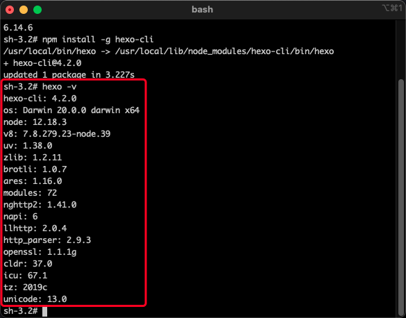

# Hexo-Setup
本文基于程序羊（CodeSheep）在b站的发布的关于博客搭建的视频，以下均为学习笔记。

## 准备工作
下载：
- [node.js](https://nodejs.org)
- iTerm

## 部署
打开 `iTerm`，输入 `sudo su`，输入密码以root身份运行。  
如果出现 `sh-3.2#` 字样说明成功。  
  

我们可以查看以下 `node` 和 `npm` 的版本以确保安装成功  
分别为 `node -v` 和 `npm -v`，如果出现版本号则说明安装成功。  
 

**国内用户需安装 `cnpm`**  
输入以下指令即可：  
`npm install -g cnpm --registry=http://registry.npm.taobao.org`

安装完成后，输入 `cnpm -v` 查看 `cnpm` 版本以确保安装无误。

## 安装hexo框架
输入 `npm install -g hexo-cli` 以安装 `hexo` 框架
 

**国内用户使用 `cnpm` 安装框架即可。**  
输入 `cnpm install -g hexo-cli` 以安装 `hexo` 框架

安装完成后，输入 `hexo -v` 查看 `hexo` 版本，以确保安装成功  
 

## 生成博客
输入 `mkdir blog` 以创建一个名字为`blog`的文件夹，文件夹名字没有要求，可以随便起，这里只是为了方便记忆。  

输入 `cd blog` 进入 刚创好的 `blog` 文件夹。  
不确定位置在哪的可以使用 `pwd` 来查看文件位置。  
 

输入 `sudo hexo init` 初始化博客 / 生成博客  

完成后输入 `hexo s` 启动本地博客  
启动完成后，浏览器输入 `http://localhost:4000/ `即可看到生成的博客  

## 线上博客部署
仍在施工中👷 