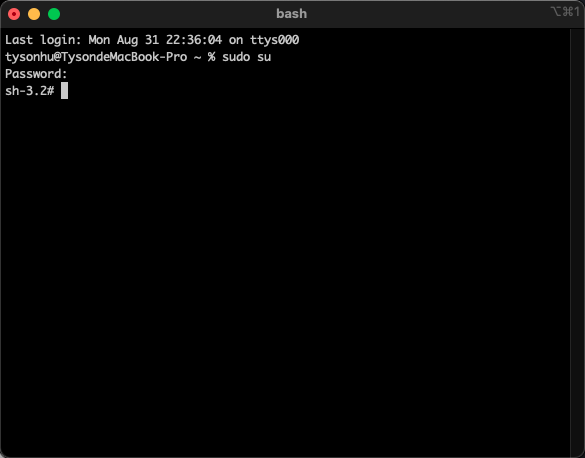
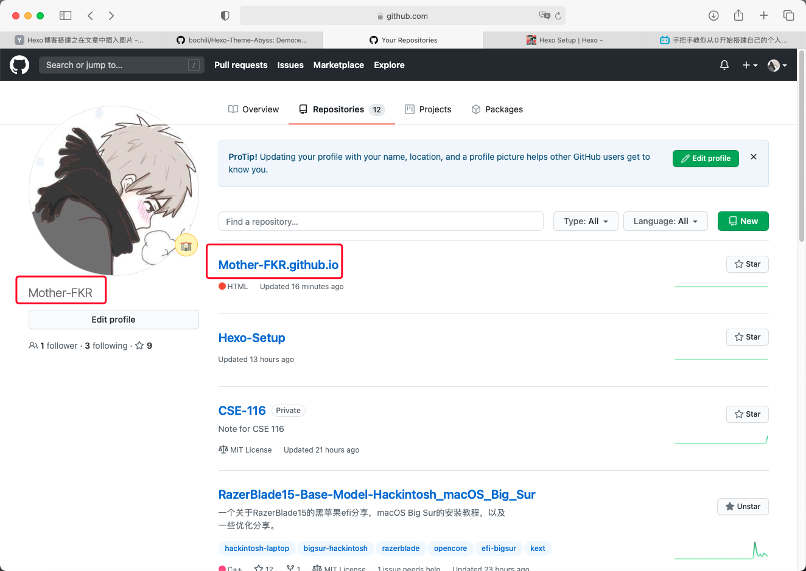
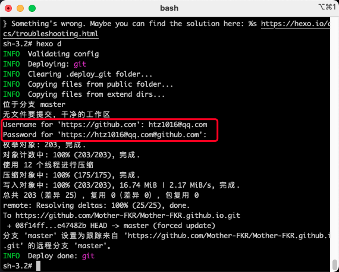

# Hexo-Setup
本文基于程序羊（CodeSheep）在b站的发布的关于博客搭建的视频，以下均为学习笔记。

## 准备工作
下载：
- [node.js](https://nodejs.org)
- iTerm

## 部署
打开 `iTerm`，输入 `sudo su`，输入密码以root身份运行。  
如果出现 `sh-3.2#` 字样说明成功。  
  

我们可以查看以下 `node` 和 `npm` 的版本以确保安装成功  
分别为 `node -v` 和 `npm -v`，如果出现版本号则说明安装成功。  
 

**国内用户需安装 `cnpm`**  
输入以下指令即可：  
`npm install -g cnpm --registry=http://registry.npm.taobao.org`

安装完成后，输入 `cnpm -v` 查看 `cnpm` 版本以确保安装无误。

## 安装hexo框架
输入 `npm install -g hexo-cli` 以安装 `hexo` 框架
 

**国内用户使用 `cnpm` 安装框架即可。**  
输入 `cnpm install -g hexo-cli` 以安装 `hexo` 框架

安装完成后，输入 `hexo -v` 查看 `hexo` 版本，以确保安装成功  
 

## 生成博客(本地)
输入 `mkdir blog` 以创建一个名字为`blog`的文件夹，文件夹名字没有要求，可以随便起，这里只是为了方便记忆。  

输入 `cd blog` 进入 刚创好的 `blog` 文件夹。  
不确定位置在哪的可以使用 `pwd` 来查看文件位置。  
 

输入 `sudo hexo init` 初始化博客 / 生成博客  

完成后输入 `hexo s` 启动本地博客  
启动完成后，浏览器输入 `http://localhost:4000/ `即可看到生成的博客  

## 线上博客部署(免费)
打开你的 `GitHub`，创建一个与你用户名同名的io库：   

举例：  
用户名： `abc`  ➡️  库名： `abc.github.io`  

 

创建后转到 `iTerm`：  
输入 `npm install --save hexo-deployer-git` 安装git部署插件   
**国内用户输入：`cnpm install --save hexo-deployer-git` 安装git部署插件**  

安装完成后输入 `vim _config.yml` 打开 `_config.yml` 文件  
 

打开文件后，直接跳转到最下面，在 `Deployment` 菜单下输入图中的参数， 
**并把 `repo` 的内容改为自己刚创建的 `repo` 的地址。** 
 

修改完成后按 `esc` 键退出编辑模式，并输入 `:wq` 保存&退出 `_config.yml`  
 

输入 `hexo d` 将本地的博客推到你的GitHub库中   
 

系统会要求你输入GitHub的用户名和密码，输入即可：  
 

至此你的本地博客已经挂到GitHub上，现在即可进行远程访问。

## 主题更换
仍在施工中，请耐心等待👷‍♀️